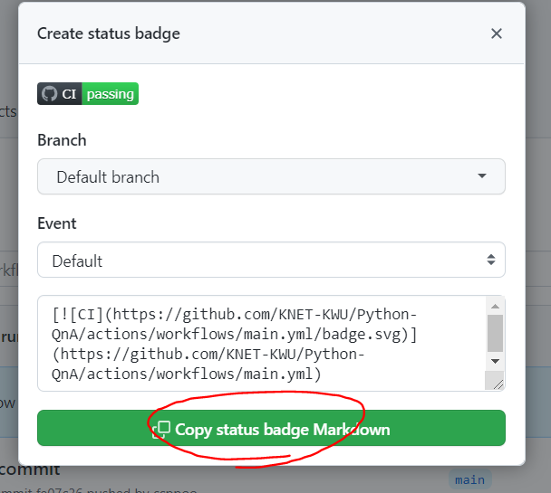

  

# Open Template

Github 템플릿

Reference :

- [github/docs(repo)](https://github.com/github/docs)

- [github docs](https://docs.github.com/en)

## For maintainers, 레포지토리 관리자에게

아래 항목 중에서 필요한 내용은 관리자분께서 필요에 따라 수정하시면 됩니다.

사용하지 않는 기능은 삭제하시면 됩니다!

초기 세팅 이후 현재 읽고 있는 `README.md` 파일은 새로운 내용으로 채우시면 됩니다!

- 📁 `.github`

  - 📁 `ISSUE_TEMPLATE` Issue Template, 이슈 템플릿

    - 📜 `config.yml` - Issue config, 이슈 구성 파일

    - 📜 `<issue_name>.md` - 개별 이슈 MarkDown 템플릿

    - 📜 `<issue_name>.yaml` - 개별 이슈 YAML 템플릿

  - 📁 `workflows` Github Action 관리하는 파일

    - 📜 `main.yml` - 기본 Github Action

- 📜 `PULL_REQUEST_TEMPLATE.md` - PR 템플릿

- 📜 `README.md` - 현재 읽고 있는 이 파일

- 📜 `LICENSE` - 라이선스

- 📜 `.gitattributes` - 깃 설정

---

### Issue Template, 이슈 템플릿

- **config.yml**

issue를 작성하기 전에 탬플릿을 고르는 화면에 나오는 내용입니다.

여기서 템플릿을 꼭 선택해도록 설정해도, 템플릿을 지울 수 있습니다! 🤬

템플릿을 강제하고 싶은 경우 마크다운 템플릿 대신 YAML 템플릿을 사용해보세요!
`blank_issues_enabled: false -> true`

- **example1.md**

마크다운 형식의 issue 템플릿입니다.

기존의 issue에 마크다운이 대신 작성된 것으로 자유롭게 편집이 가능하나

결국 사용자가 지우면 템플릿이 템플릿 노릇을 못하게 됩니다. 😒

- **example2.yaml**

Yaml 형식의 issue 템플릿입니다.

issue 템플릿을 강제할 수 있으며, 다른 한편으로 작성하기 쉬울 수 있습니다. 😀

템플릿의 강제성은 편리할 수 있으나, 작성자의 입장에서 불편할 수 있습니다.

모든 템플릿을 yaml 형식으로 할 경우 혹시 모를 자유로운 영혼을 위해 `blank_issues_enabled: false`를 지정해 주세요!

---

### WorkFlow - with Github Action

Workflow의 경우 직접 `.yml` 파일을 직접 작성하는 것보다 웹 페이지 상에서 추가하는 것이 간단합니다.

`.yml` 파일 하나에는 여러 작업이 정의되어 있을 수 있고, 파일 이름은 작업과 상관이 없습니다.

- main.yml, github-actions-demo.yml

[Gthub Action 샘플 코드](https://docs.github.com/en/actions/quickstart)와 `.yml` 파일을 통해 어떻게 메타데이터를 사용할 수 있는지에 대한 예시입니다.

- labels.yml

[label-syncer](https://github.com/marketplace/actions/label-syncer)

`.yml` 파일에 저장한 레이블을 동기화 시켜주는 Github Action 입니다.

[Github MarketPlace](https://github.com/marketplace?category=&query=&type=actions&verification=)를 통해 다양한 자동화 작업을 이용해보세요!

---

### PR Template, PR 템플릿

- **PULL_REQUEST_TEMPLATE.md**

PR을 요청할 때 생기는 마크다운 형식의 탬플릿 입니다.

issue와 달리 yaml 형식의 템플릿은 아직 없습니다.

---

### Update status badge, 뱃지 업데이트하기

Public template을 이용한 레포지토리를 만든 후 Status badge를 본인의 레포지토리에 맞게 업데이트 해야합니다.

Actions -> Click one of Workflows running -> Click `...` at right -> Copy status badge Markdown -> Paste at README.md

---

### Contribute

컨트리뷰트는 언제나 열려있습니다
